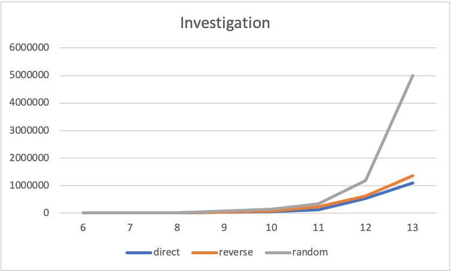

# Investigation

#### Diagram: 

- **Travel_variant:** direction

  <u>Experiment:</u>

  - number: **1**

  - input_data:

    		buffer_size: 32 Kb

  - results:

    		duration: 3036 ns

    
  <u>Experiment:</u>
  
  - number: **2**

  - input_data:

    		buffer_size: 64 Kb

  - results:

    		duration: 7685 ns

    

  <u>Experiment:</u>

  - number: **3**

  - input_data:

    		buffer_size: 128 Kb

  - results:

    		duration: 16122 ns

    

  <u>Experiment:</u>

  - number: **4**

  - input_data:

    		buffer_size: 256 Kb

  - results:

    		duration: 33564 ns

    

  <u>Experiment:</u>

  - number: **5**

  - input_data:

    		buffer_size: 512 Kb

  - results:

    		duration: 63284 ns

    

  <u>Experiment:</u>

  - number: **6**

  - input_data:

    		buffer_size: 1 Mb

  - results:

    		duration: 125413 ns

    

  <u>Experiment:</u>

  - number: **7**

  - input_data:

    		buffer_size: 2 Mb

  - results:

    		duration: 527986 ns

    

  <u>Experiment:</u>

  - number: **8**

  - input_data:

    		buffer_size: 4 Mb

  - results:

    		duration: 1093626 ns

- **Travel_variant:** reverse

  <u>Experiment:</u>

  - number: **1**

  - input_data:

    		buffer_size: 32 Kb

  - results:

    		duration: 3582 ns

    

  <u>Experiment:</u>

  - number: **2**

  - input_data:

    		buffer_size: 64 Kb

  - results:

    		duration: 8217 ns

    

  <u>Experiment:</u>

  - number: **3**

  - input_data:

    		buffer_size: 128 Kb

  - results:

    		duration: 18653 ns

    

  <u>Experiment:</u>

  - number: **4**

  - input_data:

    		buffer_size: 256 Kb

  - results:

    		duration: 39599 ns

    

  <u>Experiment:</u>

  - number: **5**

  - input_data:

    		buffer_size: 512 Kb

  - results:

    		duration: 69639 ns

    

  <u>Experiment:</u>

  - number: **6**

  - input_data:

    		buffer_size: 1 Mb

  - results:

    		duration: 224118 ns

    

  <u>Experiment:</u>

  - number: **7**

  - input_data:

    		buffer_size: 2 Mb

  - results:

    		duration: 611007 ns

    

  <u>Experiment:</u>

  - number: **8**

  - input_data:

    		buffer_size: 4 Mb

  - results:

    		duration: 1358738 ns

- **Travel_variant:** random

  <u>Experiment:</u>

  - number: **1**

  - input_data:

    		buffer_size: 32 Kb

  - results:

    		duration: 3133 ns

    

  <u>Experiment:</u>

  - number: **2**

  - input_data:

    		buffer_size: 64 Kb

  - results:

    		duration: 7724 ns

    

  <u>Experiment:</u>

  - number: **3**

  - input_data:

    		buffer_size: 128 Kb

  - results:

    		duration: 23051 ns

    

  <u>Experiment:</u>

  - number: **4**

  - input_data:

    		buffer_size: 256 Kb

  - results:

    		duration: 76015 ns

    

  <u>Experiment:</u>

  - number: **5**

  - input_data:

    		buffer_size: 512 Kb

  - results:

    		duration: 133452 ns

    

  <u>Experiment:</u>

  - number: **6**

  - input_data:

    		buffer_size: 1 Mb

  - results:

    		duration: 348146ns

    

  <u>Experiment:</u>

  - number: **7**

  - input_data:

    		buffer_size: 2 Mb

  - results:

    		duration: 1189555 ns

    

  <u>Experiment:</u>

  - number: **8**

  - input_data:

    		buffer_size: 4 Mb

  - results:

    		duration: 4993859 ns

    

    

    

    

  ​                          